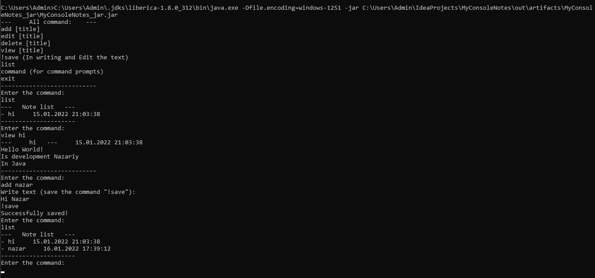
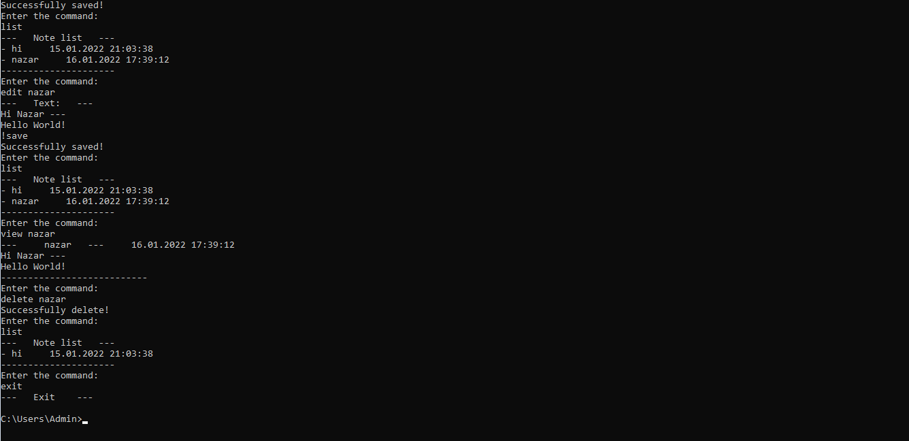
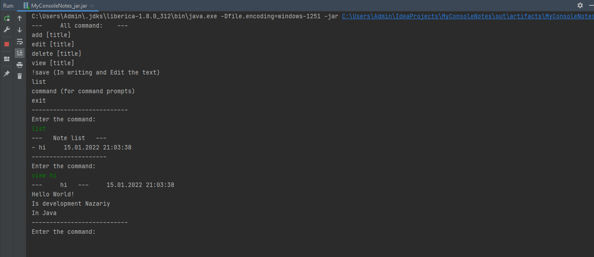
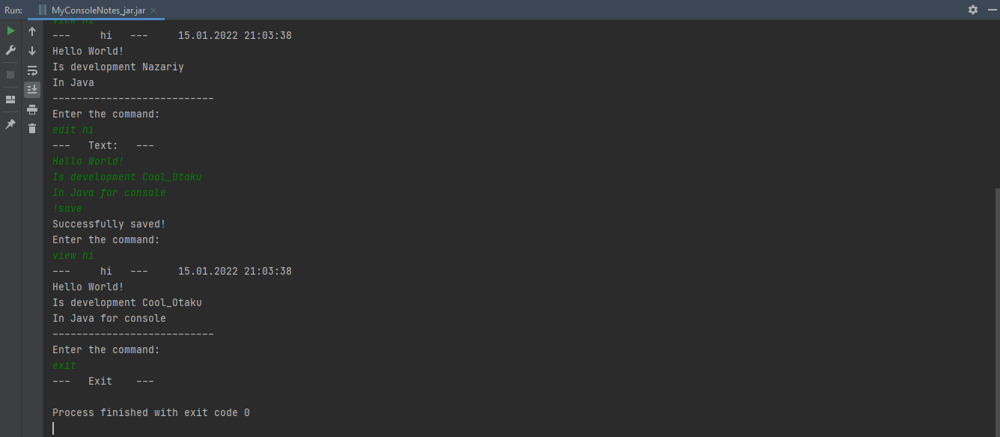

<p align="center"></p>
<h1 align="center">MyConsoleNotes</h1>

## Description
<b>EN:</b>

Console analogue of "[MyNotes](https://github.com/CoolOtaku/MyNotes)", created in one day 😁.

<b>UA:</b>

Консольний аналог "[MyNotes](https://github.com/CoolOtaku/MyNotes)", створений за один день 😁.

#
## Screenshots
<p>
  
  
  
  
</p>

#
## Technologies used
<b>EN:</b>
- Work with the command line of the operating system
- Working with files

<b>UA:</b>
- Робота з командним рядком операційної системи
- Робота з файлами

#
## License
```
© 2022, CoolOtaku (ericspz531@gmail.com)
```
